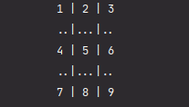
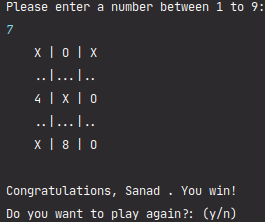
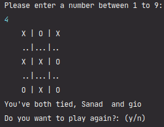
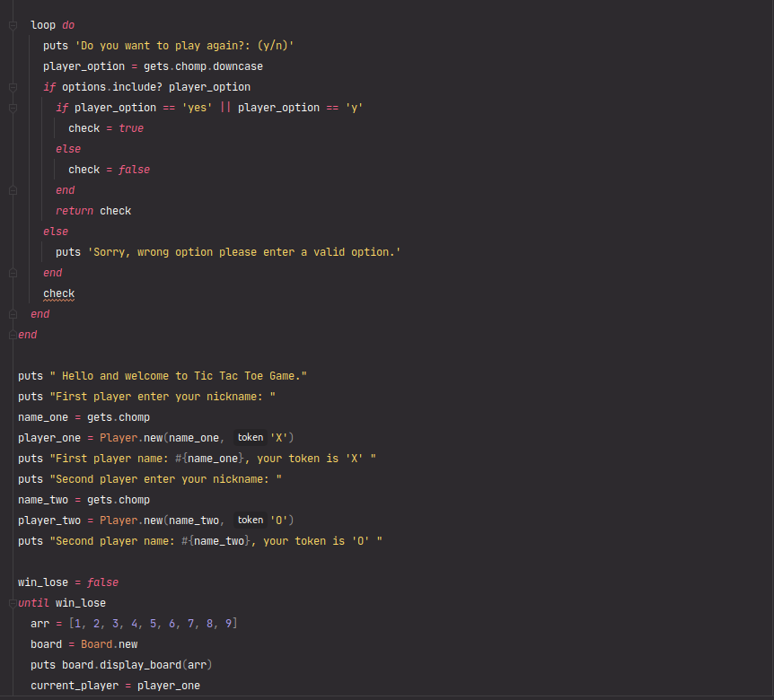
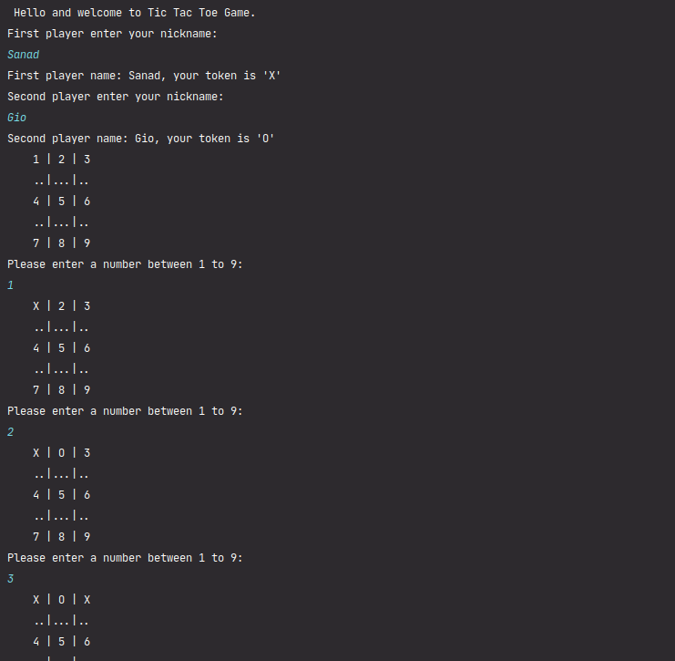

# 🧐 Tic-Tac-Toe-Game project

> Ruby's Tic-Tac-Toe Project

## Concept
> Tic-tac-toe, noughts and crosses, or Xs and Os is a paper-and-pencil game for two players, X and O, who take turns marking the spaces in a 3×3 grid. The player who succeeds in placing three of their marks in a horizontal, vertical, or diagonal row is the winner.
 

## 🛠 Getting Started

> To get a local copy up and running follow these simple example steps.

- Go to the main page of the repo.
- Press the "Code" button and get the repo link.
- Clone it using git clone.

### 📝 Prerequisites

- Ruby -v2.7.0p0

### 📝 Setup

 - Open a terminal
 - Copy this code : 
        ```
        git clone "put the link from github repo"
        ```
- Run the program with this code :
        ```
        main
        ```
### How To Play
   - When run the game an empty board will shown:
    
   
 
   - Have the first player go first. Though traditionally, the first player goes with "X"
    
   - Have the second player go second. The second player goes with "O"
   
   - Keep alternating moves until one of the players has drawn a row of three symbols and WIN
   
    - Win
   
  
   - Or Keep alternating moves until the players Tied and no one when 
  
    - Tied 
   


## Screenshots
    
 
        
 <br>      
 <br>  

 
 ## 🔧 Built With
 
 - Ruby v.2.7.0p0
 - Using Linters for Ruby Rubocop.
 - Using Bundler.

### Usage

- Personal Project - Create a Tic-Tac-Toe-Game to run basic concepts of Ruby language just for learning propose.

## 👤 Authors

👤 **Giordano Díaz**

- Github: [@diazgio](https://github.com/diazgio)
- Twitter: [@giordano_diaz](https://twitter.com/giordano_diaz)
- LinkenIn:[LinkenIn](www.linkedin.com/in/Giordano-Diaz)

👤 **Sanad Walid Abujbara**

- Github: [@sanadwj](https://github.com/sanadwj)
- Twitter: [@sandooog](https://twitter.com/sandooog)
- Linkedin: [sanad-abujbara](https://linkedin.com/in/sanad-abujbara)

## 🤝 Contributing

Contributions, issues and feature requests are welcome!

Feel free to check the [issues page](issues/).

## Show your support

Give a ⭐️ if you like this project!

## Acknowledgments

- Hat tip to anyone whose code was used
- Inspiration
- etc

## 📝 License

This project is [MIT](lic.url) licensed.
